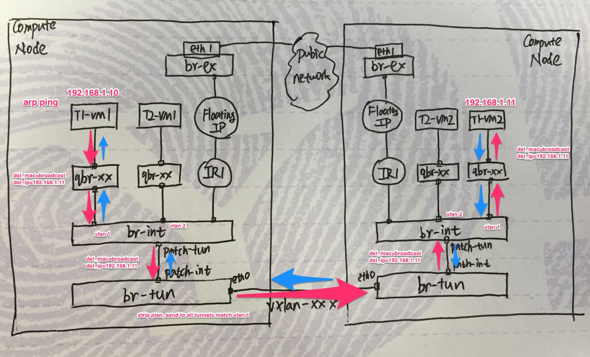

# Neutron networking (ml2/vxlan/dvr)

## Network Design Goals

* Convey data
  * Control data. Generated by admin/users.
  * User data. Generated by users.
* Virtualization
  * Ability to create virtual networks over physical network
  * Isolation between different tenant networks

## Packet Flows:

* North-South Flows:
  * North — traffic out of the data centre
  * South — traffic into the data centre
* East-West Flows:
  * Traffic inside the data centre

## Network Architecture

Generally we have 3 types of nodes (physical servers):

* Control Nodes
* Network Nodes
* Compute Nodes

Control data that convey task info (i.e. create router, delete port) flows between:
* control node — network node
* control node — compute node

All message interactions are RPC calls via message queue. Rabbit MQ is used in our deployment scenario.

East-West user data flows between compute nodes and network nodes. North-South user data flows among compute/network nodes and external public network.
Without DVR(Distributed Virtual Router) enabled, only network nodes display the L3 router role, which leads to the fact that all north-south packets and cross-network east-west packets flow via network nodes, giving  too much burden to these nodes and increasing the overall risk of network node down.
DVR feature is designed to solve this problem. Key thought of DVR is making compute nodes handle east-west flow and non-snat flow and decreasing the dependency of network nodes.

Table below clearly describes changes brought by DVR.

| / | East-West: same network | East-West: different networks  | North-South: no floating ip (SNAT needed) | North-South: floating ip configured |
| :------: | :------: | :-----: | :-----: | :-----: |
| Without DVR  | CN - CN | CN - NN - CN | CN - NN - External | CN - NN - External |
| DVR enabled  | CN - CN | CN - CN | CN - NN - External | CN - External |

(CN: Compute Node; NN: Network Node)

** Without DVR **

** With DVR **

## Deployment Scenarios

** Scenario 1: East-West Traffic for instances using same network on same node **

** Scenario 2: East-West Traffic for instances using same network on different nodes **
arp ping

data req

** Scenario 3: East-West Traffic for instances using different network on same router on same node  **

** Scenario 4: East-West Traffic for instances using different network on same router on different nodes **

** Scenario 5: North-South Traffic for instance using floating ip (outside traffic) **

** Scenario 6: North-South Traffic for instance using floating ip (inside traffic) **

** Scenario 7: North-South Traffic for instance without using floating ip **

